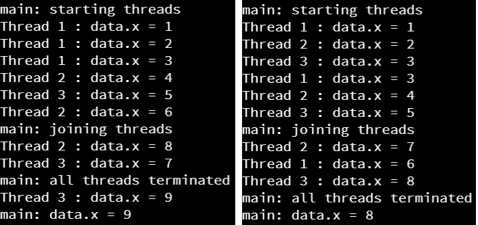
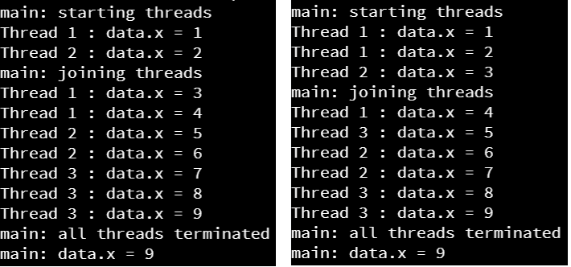

Next, let's look at a quick example of a race condition in Python, just so we can see how it could occur in our code.

## Poorly Designed Multithreading

First, let's consider this example:

```python
import threading
import time
import sys


class MyData:
    
    def __init__(self):
        self.x = 0

class MyThread:
    
    data = MyData()

    def __init__(self, name):
        """Constructor.
        
        Args:
            name: the name of the thread
        """
        self.__name = name

    def run(self):
        """Thread method."""
        for i in range(0, 3):
            y = MyThread.data.x
            # tell the OS it is ok to switch to another thread here
            time.sleep(0)
            MyThread.data.x = y + 1
            print("{} : data.x = {}".format(self.__name, MyThread.data.x))
            
    @staticmethod
    def main(args):
        # create threads
        t1_object = MyThread("Thread 1")
        thread1 = threading.Thread(target=t1_object.run)
        t2_object = MyThread("Thread 2")
        thread2 = threading.Thread(target=t2_object.run)
        t3_object = MyThread("Thread 3")
        thread3 = threading.Thread(target=t3_object.run)
        
        # start threads
        print("main: starting threads")
        thread1.start()
        thread2.start()
        thread3.start()
        
        # wait until all threads have terminated
        print("main: joining threads")
        thread1.join()
        thread2.join()
        thread3.join()
        print("main: all threads terminated")
        print("main: data.x = {}".format(MyThread.data.x))
                  
                  
# main guard
if __name__ == "__main__":
    MyThread.main(sys.argv)

```

#### Explanation

In this example, we are creating a static instance of the `MyData` class, attached directly to the `MyThread` class and not a particular object, which can act as a shared memory object for this example. Then, in each of the threads, we are performing this three-step process:

```python
y = MyThread.data.x
# tell the OS it is ok to switch to another thread here
time.sleep(0)
MyThread.data.x = y + 1
```

Just as we saw in the earlier example, we are reading the current value stored in `data.x` into a variable `y`. Then, we are using the `time.sleep(0)` method to tell the operating system to put this thread to sleep, but then immediately add it back to the list of threads to be scheduled on the processor. Finally, we update the value stored in `data.x` to be one larger than the value we saved earlier. 

In effect, this is essentially the Python code needed to reproduce the example we saw earlier in this class.

#### Execution

So, what happens when we run this code? As it turns out, sometimes we'll see it get a different result than the one we expect:



Uh oh! This is exactly what a race condition looks like in practice. In the screenshot on the right, we see that two threads set the same value into `data.x`, which means that they were running at the same time. 

## Python Lock

To fix this, Python includes a **lock** that we can use as part of a `with` statement, which is simply a wrapper around a block of code that we'd like to be **atomic**. An atomic block is one that shouldn't be broken apart and interrupted by other threads accessing the same object. In effect, using a `with` statement along with a lock will handle acquiring and releasing the lock for us.

So, in this example, we can update the `MyThread` class to have a lock:

```python
class MyThread:
    
    data = MyData()
    lock = threading.Lock()
```

When, we can update the `run()` method to use a `with` statement:

```python
    def run(self):
        for i in range(0, 3):
            with MyThread.lock:
                y = MyThread.data.x
                # tell the OS it is ok to switch to another thread here
                time.sleep(0)
                MyThread.data.x = y + 1
                print("{} : data.x = {}".format(self.__name, MyThread.data.x))
            time.sleep(0)
```

Here, the `with` statement acquires the **lock** that is associated with the `data` object in the `MyThread` class. Only one thread can hold that lock at a time, and by associating it with an object, we can easily keep track of which thread is able to access that object. 

Now, when we execute that program, we'll always get the correct answer!



{}

# Not Always Random?

In fact, to get the threads interleaved as shown in this screenshot, we had to add additional `time.sleep(0)` statements to the code! Otherwise, the program always seemed to schedule the threads in the same order on Codio. We cannot guarantee it will always happen like that, but it is an interesting quirk you can observe in multithreaded code. In practice, sometimes race conditions may only happen once in a million operations, making them extremely difficult to debug when they happen.

{}

