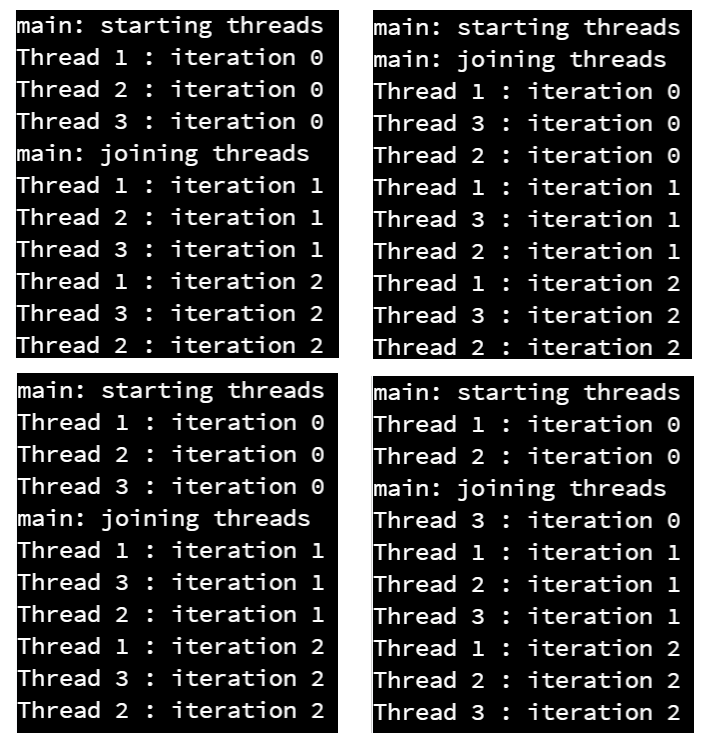

Java includes several methods for creating threads. The simplest and most flexible is to implement the [Runnable](https://docs.oracle.com/javase/8/docs/api/java/lang/Runnable.html) interface in a class, and then create a new [Thread](https://docs.oracle.com/javase/8/docs/api/java/lang/Thread.html) that uses an instance of the class implementing `Runnable` as it's target. 

It is also possible to create a class that inherits from the `Thread` class, which itself implements the `Runnable` interface. However, this is not recommended unless you need to perform more advanced work within the thread. 

Here's a quick example of threads in Java:

```java
import java.lang.Runnable;
import java.lang.Thread;
import java.lang.InterruptedException;

public class MyThread implements Runnable {

    private String name;

    /**
     * Constructor.
     * 
     * @param name the name of the thread
     */
    public MyThread(String name) {
        this.name = name;
    }
    
    /**
     * Thread method.
     * 
     * <p>This is called when the thread is started.
     */
    @Override
    public void run() {
        for (int i = 0; i < 3; i++) {
            System.out.println(this.name + " : iteration " + i);
            try {
                // tell the OS to wake this thread up after at least 1 second
                Thread.sleep(1000);
            } catch (InterruptedException e) {
                System.out.println(this.name + " was interrupted");
            }
        }
    }
    
    /**
     * Main Method.
     */
    public static void main(String[] args) {
        // create threads
        Thread thread1 = new Thread(new MyThread("Thread 1"));
        Thread thread2 = new Thread(new MyThread("Thread 2"));
        Thread thread3 = new Thread(new MyThread("Thread 3"));
        
        // start threads
        System.out.println("main: starting threads");
        thread1.start();
        thread2.start();
        thread3.start();
        
        // wait until all threads have terminated
        System.out.println("main: joining threads");
        try {
            thread1.join();
            thread2.join();
            thread3.join();
        } catch (InterruptedException e){
            System.out.println("main thread was interrupted");
        }
        System.out.println("main: all threads terminated");
    }
}
```

Let's look at this code piece by piece so we fully understand how it works.

#### Imports

```java
import java.lang.Runnable;
import java.lang.Thread;
import java.lang.InterruptedException;
```

We import both the `Runnable` interface and the `Thread` class, as well as the `InterruptedException` exception class. We have to wrap a few operations in a try-catch block to make sure that the thread isn't interrupted by the operating system unexpectedly. 

#### Class Declaration

```java
public class MyThread implements Runnable {

    private String name;

    public MyThread(String name) {
        this.name = name;
    }
    
    // ...
}
```

The class is very simple. It implements the `Runnable` interface, which allows to wrap it in a `Thread` as we'll see later. Inside of the constructor, we are simply setting a `name` attribute so we can tell our threads apart.

#### Run Method

```java
    @Override
    public void run() {
        for (int i = 0; i < 3; i++) {
            System.out.println(this.name + " : iteration " + i);
            try {
                // tell the OS to wake this thread up after at least 1 second
                Thread.sleep(1000);
            } catch (InterruptedException e) {
                System.out.println(this.name + " was interrupted");
            }
        }
    }
```

The `run()` method is declared in the `Runnable` interface, so we must override it in our code. This method is pretty short - it simply iterates 3 times and prints the value of the iteration along with the thread's name, and then it uses the `Thread.sleep(1000)` method call. This tells the operating system to put this thread into a waiting state, and to not wake it up until at least 1000 milliseconds (1 second) has elapsed. Of course, we can't guarantee that the operating system won't make this thread wait even longer than that, but typically it will happen so fast that we won't be able to tell the difference. 

However, many of the methods in the `Thread` class can throw an `InterruptedException` if the thread is interrupted while it is performing this operation. In practice, it happens rarely, but it is always recommended to wrap these operations in a try-catch statement. 

#### Main Method

```java
    public static void main(String[] args) {
        // create threads
        Thread thread1 = new Thread(new MyThread("Thread 1"));
        Thread thread2 = new Thread(new MyThread("Thread 2"));
        Thread thread3 = new Thread(new MyThread("Thread 3"));
        
        // start threads
        System.out.println("main: starting threads");
        thread1.start();
        thread2.start();
        thread3.start();
        
        // wait until all threads have terminated
        System.out.println("main: joining threads");
        try {
            thread1.join();
            thread2.join();
            thread3.join();
        } catch (InterruptedException e){
            System.out.println("main thread was interrupted");
        }
        System.out.println("main: all threads terminated");
    }
```

Finally, the `main()` method will create three instances of the `Thread` class, and provide an instance of our `MyThread` class, which implements the `Runnable` interface, as arguments to the constructor. In effect, we are _wrapping_ our runnable class in a thread. 

Then, we call the `start()` method on the thread, which will actually create the thread through the operating system and start it running. Notice that we **do not** call the `run()` method directly - that is called for us once the thread is created in the `start()` method. 

Finally, we call the `join()` method on each thread. The `join()` method will block this thread until the thread we called it on has terminated. So, by calling the `join()` method on each of the three threads, we are making sure that they have all finished their work before the main thread continues. Once again, this could throw an `InterruptedException`, so we'll use a try-catch statement to handle that.

That's all there is to this example!

#### Execution

When we execute this example, we can see many different outputs, depending on how the threads are scheduled with the operating system. Below are a few that were observed when this program was executed during testing.



If you look closely at these four lists, no two of them are exactly the same. This is because of how the operating system schedules threads - we cannot predict how it will work, and because of this a multithreaded program could run differently each time it is executed!
