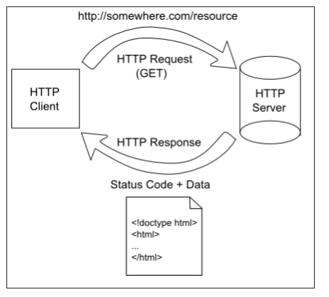

Earlier in this chapter, we discussed how HTTP is a request-response protocol, as shown in this diagram:

We also discussed how we could write a simple dynamic program to generate a response by concatenating strings together. It was definitely not efficient, but it demonstrated that it is possible to dynamically generate a response to a web request.

Web frameworks simplify this process greatly by handling most of the work for us. As developers, all we really need to do is collect the data that should be contained in the response, and create the template used to generate the web page. 

## Requests & Responses

Let's look at the diagram below, which shows the process that a MVC-based web framework, such as Spring, might follow:

^[https://docs.spring.io/spring-framework/docs/3.2.x/spring-framework-reference/html/mvc.html]

First, the application will receive an incoming web request from a client, which will include a path and possibly some additional data. The framework will examine that request, and determine which part of the application should respond to it. This is a process known as _routing_, which we'll cover on the next page. 

At that point, the framework will _delegate_ the request to a piece of code, usually called a **controller**, that can respond to it. In most web applications, the controllers are the main portion of the code written by the developer that isn't part of the framework itself. So, in the controller, we can look at the request as well as the data that comes along with it, and we can collect the data needed to respond to it. 

For example, the request might include information about the user that sent the request, as well as a search term used in a search box. So, our code might collect information about that user and the search term, and use it to populate a **model** that contains all of the data that is requested. 

Once we have completed that task, we can return the model back to the framework, as well as specify a particular **template** that should be used to create the response. So, the next thing the framework will do is find the requested template and render it, substituting data from the model into the template based on the special markers included in the template. In most cases, the template is the other major part of the web application that is written by the developer. 

Finally, the rendered template is placed into an HTTP response, and the response is sent back to the client. 
