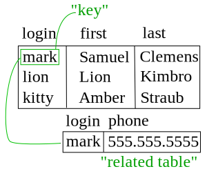

Finally, we really cannot talk about data serialization without briefly mentioning what might be the penultimate example of serialization - databases.

^[https://commons.wikimedia.org/w/index.php?title=File:Relational_key_SVG.svg&oldid=444679066]

## Database

A database is a specialized piece of software that is designed to store and retrieve large amounts of data. For many applications, especially web applications, a database is the primary method for storing data long-term, and takes the place of any data serialization to a file.

While most database systems are thought of as stand-alone applications that we connect to from our application, there are also smaller databases that can be stored and accessed from a single file, such as [SQLite](https://www.sqlite.org/index.html), which is supported directly in Python

Many databases can also store text or binary values directly, so it is possible to use the serialization methods we've already discussed to transform objects in memory and store them in a database. 

Finally, there are many [object-relational mapping](https://en.wikipedia.org/wiki/Object%E2%80%93relational_mapping), or ORM, tools available that will easily map data from a database into objects that can be used in an object-oriented manner. These can help bridge the gap between the data structures most commonly used in a database and the object-oriented data structures we are familiar with.

We won't work with databases in this class, as that is well outside of the scope of what we can cover quickly. There are later courses in the Computational Core program that cover both databases and web development in much greater detail. We simply felt that it was worth mentioning the fact that, in practice, a large amount of data serialization is actually done with databases instead of files on a file system. 
