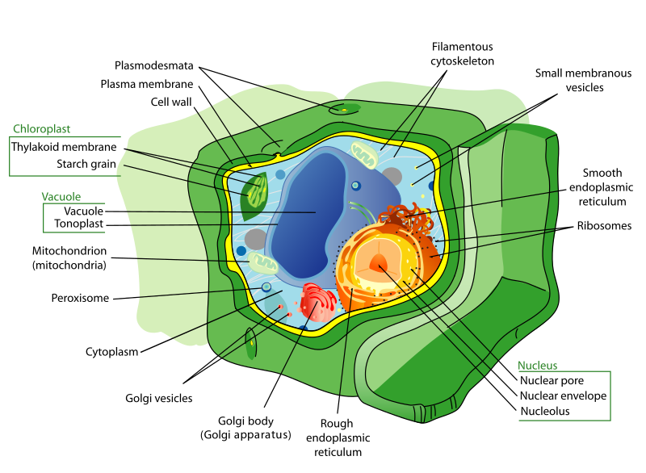

The module-based encapsulation suggested by Parnas and his contemporaries grouped state and behavior together into smaller, self-contained units.  Alan Kay and his co-developers took this concept a step farther.  Alan Kay was heavily influenced by ideas from biology, and saw this encapsulation in similar terms to _cells_.  

^[https://commons.wikimedia.org/w/index.php?title=Special:CiteThisPage&page=File%3APlant_cell_structure-en.svg&id=458951778&wpFormIdentifier=titleform]

Biological cells are also encapsulated - the complex structures of the cell and the functions they perform are all within a cell wall.  This wall is only bridged in carefully-controlled ways, i.e. cellular pumps that move resources into the cell and waste out. While single-celled organisms do exist, far more complex forms of life are made possible by many similar cells working together.

This idea became embodied in object-orientation in the form of _classes_ and _objects_.  An object is like a specific cell.  You can create many, very similar objects that all function identically, but each have their own individual and different _state_.  The _class_ is therefore a definition of that type of object's structure and behavior.  It defines the shape of the object's state, and how that state can change.  But each individual _instance_ of the class (an object) has its own current state.

Let's re-write our `Vector3` struct using this concept.

###### Java

```java
public class Vector3{
    public double x;
    public double y;
    public double z;
    
    public Vector3(double x, double y, double z){
        this.x = x;
        this.y = y;
        this.z = z;
    }
    
    public double dotProduct(Vector3 other){
        return this.x * other.x + this.y * other.y + this.z + other.z;
    }
    
    public void scale(double scalar){
        this.x *= scalar;
        this.y *= scalar;
        this.z *= scalar;
    }
}
```

###### Python

```python
class Vector3:
    
    def __init__(self, x: float, y: float, z: float) -> None:
        self.x = x
        self.y = y
        self.z = z
        
    def dot_product(self, other: Vector3) -> float:
        return self.x * other.x + self.y * other.y + self.z * other.z
    
    def scale(self, scalar: float) -> None:
        self.x *= scalar
        self.y *= scalar
        self.z *= scalar
```

Here we have defined:

1. The _structure_ of the object state - three floating point values, `x`, `y`, and `z`
2. How the object is constructed - the constructor that takes in parameters to set object's initial state
3. Instructions for how that object's state can be changed, i.e. our `scale()` method

We can create as many objects from this class definition as we might want. Each one will have the same _behavior_ but different _state_.

###### Java

```java
Vector3 one = new Vector3(1.0, 1.0, 1.0);
Vector3 up = new Vector3(0.0, 1.0, 0.0);
Vector3 a = new Vector3(5.4, -21.4, 3.11);
```

###### Python

```python
one: Vector3 = Vector3(1.0, 1.0, 1.0)
up: Vector3 = Vector3(0.0, 1.0, 0.0)
a: Vector3 = Vector3(5.4, -21.4, 3.11)
```

Conceptually, what we are doing is not that different from using a compound data type like a struct and a module of functions that work upon that struct.  But practically, it means _all the code for working with vectors appears in one place_.  This arguably makes it much easier to find all the pertinent parts of working with vectors, and makes the resulting code better organized and easier to maintain and add features to. This highlights why _encapsulation_ is one of the key concepts in object-oriented programming.
