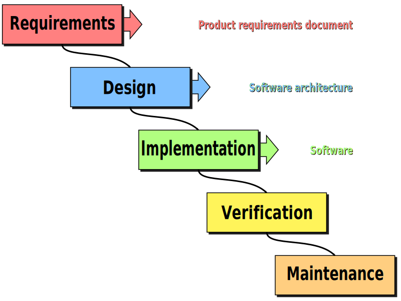

{}

As you've developed programs, you've probably run them, supplied input, and observed if what happened was what you wanted. This process is known as _informal testing_.  It's informal, because you don't have a set procedure you follow, i.e. what specific inputs to use, and what results to expect.  _Formal testing_ adds that structure.  In a formal test, you would have a written procedure to follow, which specifies _exactly_ what inputs to supply, and what results should be expected.  This written procedure is known as a _test plan_.

Historically, the test plan was often developed at the same time as the design for the software (but before the actual programming).  The programmers would then build the software to match the design, and the completed software and the test plan would be passed onto a testing team that would follow the step-by-step testing procedures laid out in the testing plan.  When a test failed, they would make a detailed record of the failure, and the software would be sent back to the programmers to fix.

This model of software development has often been referred to as the "waterfall model" as each task depends on the one before it:

^[https://commons.wikimedia.org/w/index.php?title=File:Waterfall_model.svg&oldid=453496509]

Unfortunately, as this model is often implemented, the programmers responsible for writing the software are reassigned to other projects as the software moves into the testing phase.  Rather than employ valuable programmers as testers, most companies will hire less expensive workers to carry out the testing.  So either a skeleton crew of programmers is left to fix any errors that are found during the tests, or these are passed back to programmers already deeply involved in a new project.

The costs involved in fixing software errors also grow larger the longer the error exists in the software. The table below comes from a NASA report of software error costs throughout the project life cycle: 

[^nasa2004]

[^nasa2004]: Jonette M. Stecklein, Jim Dabney, Brandon Dick, Bill Haskins, Randy Lovell, and Gregory Maroney. ["Error Cost Escalation Through the Project Life Cycle"](https://ntrs.nasa.gov/citations/20100036670), NASA, June 19, 2014.

It is clear from the graph and the paper that the cost to fix a software error grows exponentially if the fix is delayed.  You probably have instances in your own experience that also speak to this - have you ever had a bug in a program you didn't realize was there until your project was nearly complete?  How hard was it to fix, compared to a error you found and fixed right away?

It was realizations like these, along with growing computing power, that led to the development of _automated testing_, which we'll discuss next.
